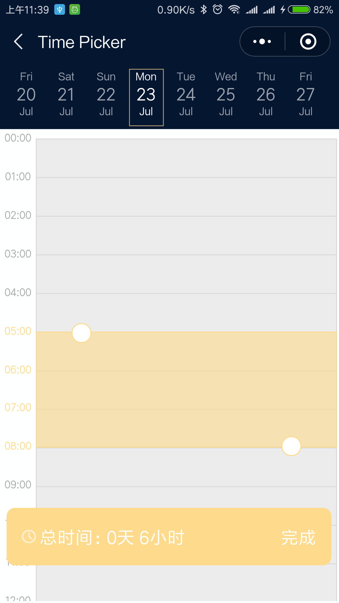

## wechat-calendar-plugin



## date-time-picker 控件允许的参数解释：

dates:优先级相对其他pro最高，主要用于再次打开恢复状态使用。  
type: Array  
defaultValue: []  
  
startTime: 可选起始日期时间。通过js的api设置的时间优先级低于pro。  
type: String  
defaultValue: 今日  
  
defaultDays: 默认可选日期数  
type: Number  
defaultValue: 100  
  
endTime: 可选结束日期时间  
type: String  
defaultValue: 加上defaultDays后得到的日期，默认100。如果同时设置defaultDays和endTime，以小者为准。通过js的api  设置的时间优先级低于pro。
  
activeDateIndex: 默认高亮激活指定索引的日期  
type: Number  
defaultValue: 0  
  
scrollToDateIndex: 日期滑动条滚动到指定索引的日期  
type: Number  
defaultValue: 0  
  
defaultCoverStartHourIndex: 首个激活打开的日期，默认选择的时间起始值  
type: Number  
defaultValue: 3  
  
defaultCoverEndHourIndex: 首个激活打开的日期，默认选择的时间结束值  
type: Number  
defaultValue: 6  
  
startHour:   每日的起始时间  
type: Number  
defaultValue: 0  
  
endHour: 每日的结束时间  
type: Number  
defaultValue: 24  
  
useSwiper: 是否启用swiper控件，用于滚动时间选择器的横向滑动。当备选日期比较多时容易影响使用体验，请注意。  
type: Boolean  
defaultValue: false  


## code

#### page.wxml

```
<date-time-picker
	binddoneevent="onDoneEvent"
	dates="{{dates}}"
	start-time=""
	default-days="300"
	active-date-index="{{activeDateIndex}}"
	default-cover-start-hour-index='3'
	default-cover-end-hour-index='6'
	start-hour='6'
	end-hour=''
	use-swiper="{{false}}" />
```

#### page.json

```
{
	"navigationBarBackgroundColor": "#051631",
	"navigationBarTextStyle": "white",
	"navigationBarTitleText": "Time Picker",
	"usingComponents": {
		"date-time-picker": "plugin://myPlugin/date-time-picker"
	}
}
```

#### page.js

```
var plugin = requirePlugin("myPlugin");
let app = getApp();
Page({
	data: {
		dates: [],
		activeDateIndex: 0,
	},
	onLoad: function(options) {
		this.setData({
			dates: app.globalData.dates || [],
			activeDateIndex: app.globalData.activeDateIndex || 0
		});
	},
	onDoneEvent: function(e) {
		console.log(e);
		app.globalData.totalTime = e.detail.totalTime;
		app.globalData.dates = e.detail.dates;
		app.globalData.activeDateIndex = e.detail.activeDateIndex;
		wx.navigateBack();
	}
})
```

#### app.json

```
{
	"pages": [],
	"plugins": {
		"myPlugin": {
			"version": "1.0.1",
			"provider": "wxbdba0f18d2aa9aa1"
		}
	}
}
```

#### app.js

```
App({
	onLaunch: function() {},
	globalData: {
		totalTime: undefined
	}
})
```

## external class

* `<date-time-picker>` 针对组件设置对应颜色属性

#### picker.wxml

```wxml
<date-time-picker
external-date-item-wrapper="date-item-wrapper"
external-date-item-active="date-item-active"
external-date-item-choosed="date-item-choosed"
external-t1="t1"
external-t2="t2"
external-t3="t3"
external-hour-item-active="hour-item-active"
external-top-date-swiper="top-date-swiper"
external-cover="external-cover"
external-cover-before="external-cover-before"
external-cover-before-before="external-cover-before-before"
external-cover-after="external-cover-after"
external-cover-after-after="external-cover-after-after"
external-total-time-pannel="total-time-pannel"
binddoneevent="onDoneEvent"
dates="{{dates}}"
start-time=""
default-days="20"
active-date-index="{{activeDateIndex}}"
default-cover-start-hour-index='3'
default-cover-end-hour-index='6'
start-hour='0'
end-hour='24'
use-swiper="{{false}}"
/>
```

#### picker.wxss

```wxss
.date-item-wrapper {
	border-color: blue !important;
	border: 1px solid rgba(0, 255, 0, 0) !important;
}

.date-item-choosed {
	border: 1px dashed rgba(0, 255, 0, .6) !important;
	opacity: .6 !important;
}

.date-item-active {
	border: 1px solid rgba(0, 255, 0, .6) !important;
	opacity: 1 !important;
}

.t1 {
	color: green !important;
}

.t2 {
	color: green !important;
}

.t3 {
	color: green !important;
}

.top-date-swiper {
	background-color: #EEE !important;
	border-bottom: 1px solid #DDD;
}

.external-cover {
	background-color: rgba(0, 255, 0, 0.1) !important;
}

.external-cover-before {
	border-top: 1px solid green !important;
}

.external-cover-before-before {
	display: block;
	z-index: 12;
	width: 40rpx;
	height: 40rpx;
	border-radius: 40rpx;
	border: 1px solid green;
	background: #FFFFFF;
	position: absolute;
	left: 80rpx;
	top: -20rpx;
}

.external-cover-after {
	border-bottom: 1px solid green !important;
}

.external-cover-after-after {
	display: block;
	z-index: 12;
	width: 40rpx;
	height: 40rpx;
	border-radius: 40rpx;
	border: 1px solid green;
	background: #FFFFFF;
	position: absolute;
	right: 80rpx;
	bottom: -20rpx;
}

.total-time-pannel {
	color: white !important;
	background-color: green !important;
}

.hour-item-active {
	color: green !important;
}
```

## feedback

* visit https://github.com/MeetBest/calendar_wechat_app_demo  
* mail to <gm.dai@meetbest.com>  


